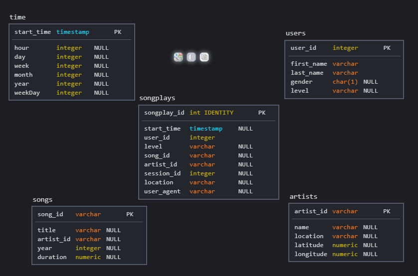

# Introduction

A music streaming startup, Sparkify, has grown their user base and song database and want to move their processes and data onto the cloud. Their data resides in S3, in a directory of JSON logs on user activity on the app, as well as a directory with JSON metadata on the songs in their app.

As their data engineer, you are tasked with building an ETL pipeline that extracts their data from S3, stages them in Redshift, and transforms data into a set of dimensional tables for their analytics team to continue finding insights in what songs their users are listening to. You'll be able to test your database and ETL pipeline by running queries given to you by the analytics team from Sparkify and compare your results with their expected results.

# Project Description

In this project, you'll apply what you've learned on data warehouses and AWS to build an ETL pipeline for a database hosted on Redshift. To complete the project, you will need to load data from S3 to staging tables on Redshift and execute SQL statements that create the analytics tables from these staging tables.

## Data Source

There are 2 data sources that we are going to use. These are SONG_DATA and LOG_DATA.
It is data that lives in a public bucket.
- SONG_DATA (s3://udacity-dend/song_data) contains song and artist information.
- LOG_DATA (s3://udacity-dend/log_data) contains information on actions made by users.

The data from s3 will travel to redshift to have the star model populated.
Amazon S3 is the perfect candidate for handling large volumes of data and Amanzon Redshift is perfect for processing and storing this data in a datawartehouse.

## Star Schema

The benefits provided by the star scheme to understand different business logics in a simple way are incredible.
The star schema is characterized by having one or more fact tables referencing the dimension tables.
Sparkify has defined the following schema:

- **Fact Table:** songplays: attributes referencing to the dimension tables
- **Dimension Tables:** users, songs, artists and time table

# ETL Process
For this project, we use SQL for the ETL and python as a bridge. The transformation and data normalization is done by Query, see the sql_queries.py for more details.

# How to run process
1. Start up a AWS Redshift Cluster
- We must to make sure to setup the IAM role with AmazonS3ReadOnlyAccess.
- Use dc2.large cluster with 4 nodes.Every node costs USD 0.25/h (on-demand option) per cluster

2. Open up a terminal session

3. Run 'python3 create_tables.py'
- This will create the tables, must be run first

4. Run 'python3 etl.py'
- This will run the ETL process

# Project Structure
- create_tables.py - Script will drop old tables (if exist) ad re-create new tables
- etl.py - Script will executes the queries that extract JSON data from the S3 bucket and ingest them to Redshift
- sql_queries.py - File that contains variables with SQL statement in String formats, partitioned by CREATE, DROP, COPY and INSERT statements
- dhw.cfg - Configuration file used that contains info about Redshift, IAM and S3
